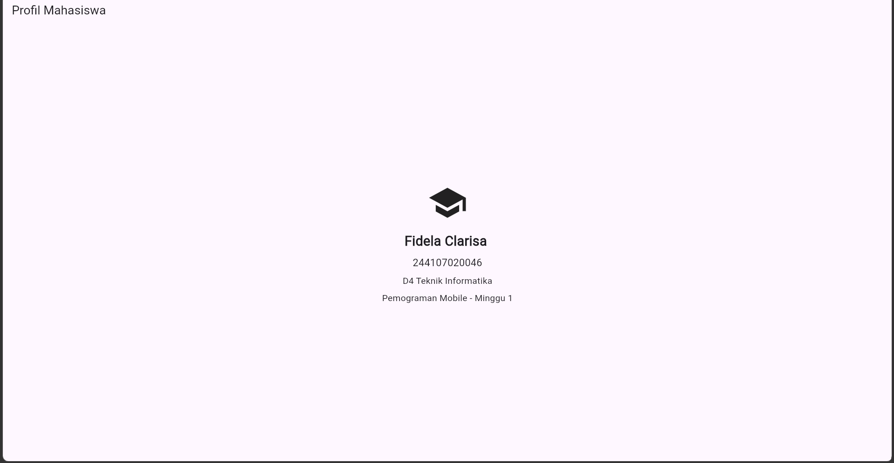
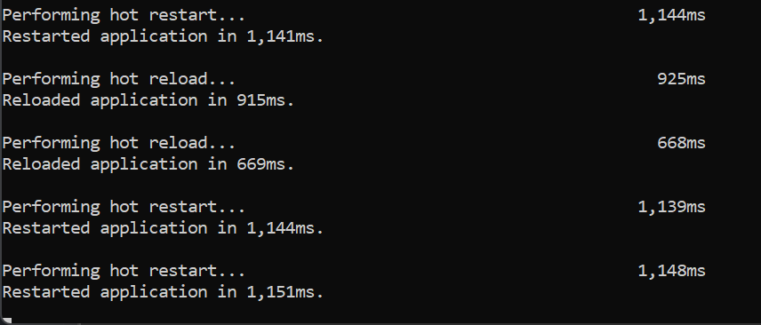

# Week 1 - Mobile Development Ecosystem & Flutter Refresh

Learning mobile application development using Flutter and Dart.
as well as installing, configuring and verifying the Flutter environment.
#
The application displays a student profile page consisting of:
- An AppBar with the title "Student Profile"
- A school icon
- Student name "Fidela Clarisa"
- Student ID (NIM) "244107020046"
- Information "D4 Teknik Informatika"
- Description "Pemrograman Mobile - Minggu 1"

#### Teknologi
- Flutter
- Dart
- Visual Studio Code
- Android Studio
- Git
- GitHub

## Screenshot
#### Flutter Doctor

#### Flutter Device

##### Profil Mahasiswa

#### Flutter Run

- r (Hot reload) = memperbarui perubahan kode dengan lebih cepat tanpa memulai ulang aplikasi secara keseluruhan. Pada gambar diatas, proses hot reload membutuhkan waktu sekitar 668–925 ms.

- R (Hot Restart) = menjalankan ulang aplikasi dari awal sehingga state sementara aplikasi akan di-reset, dan pada proses hot restart membutuhkan waktu sekitar 1.1 detik.

#### Reflection
[Week 01 Reflection](../notes/reflections/Week01.md).