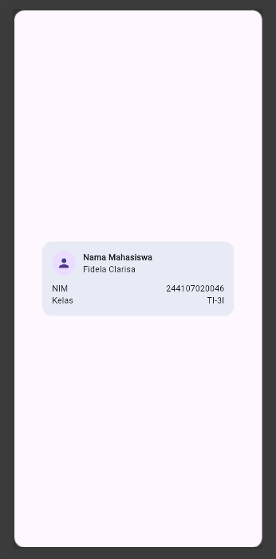
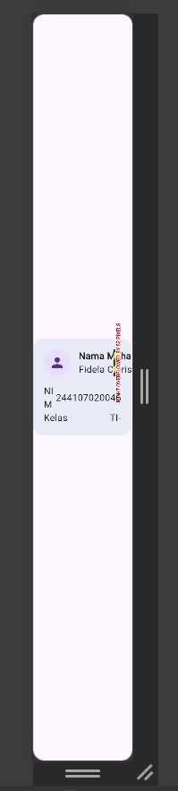
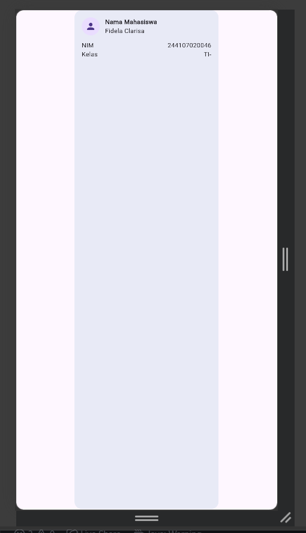
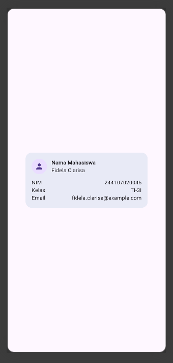
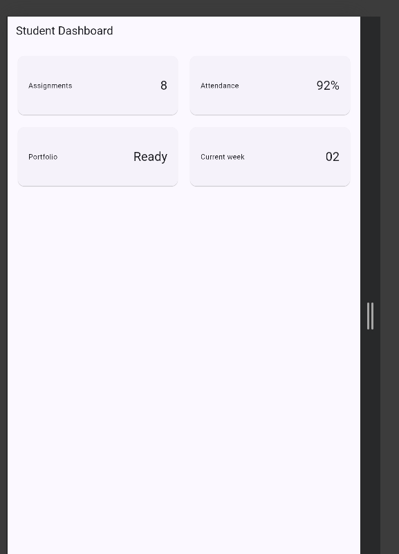
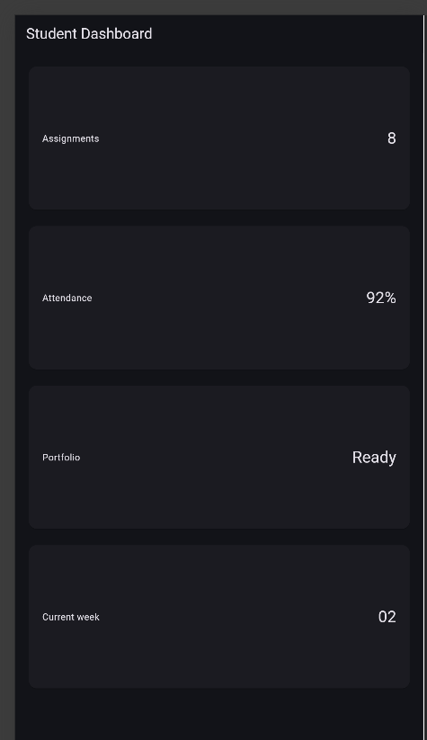
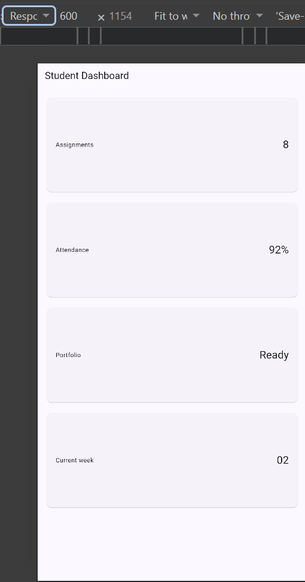
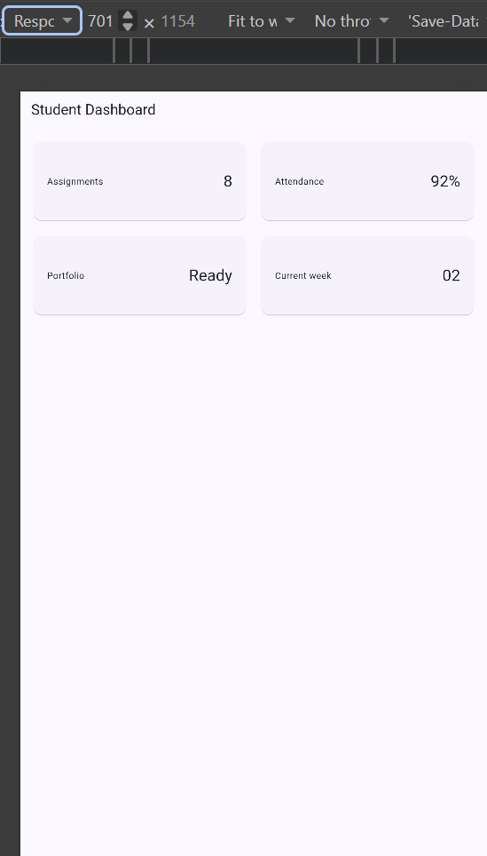
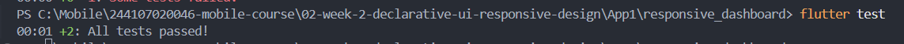

# Week 2 - declarative UI responsive design

### Checklist verifikasi
- [x] flutter analyze tidak menghasilkan error.
- [x] flutter test lulus semua widget test responsif.
- [x] Aplikasi dapat dijalankan pada ukuran layar sempit dan lebar.
- [x] Dark mode memiliki kontras dan teks yang terbaca.
- [x] Struktur widget dapat dijelaskan saat code review.
- [x] Screenshot, folder test/, dan README sudah tersimpan pada folder tugas Week 2.

#
### Praktikum Step 4


#### Eksperimen warm-up
### 1. Hapus Expanded pada baris nama, lalu amati peringatan overflow atau perilaku layout-nya; kembalikan setelah itu.



### 2. Ganti mainAxisSize: MainAxisSize.min menjadi nilai default dan amati perubahan tinggi kartu.



### 3. Tambahkan satu baris data (misal Email) menggunakan pola Row + Expanded yang sama.



#
### Praktikum Step 5

#### Eksperimen layout
### 1. Ubah breakpoint dari 700 menjadi nilai lain dan amati perubahan jumlah kolom.
- Mengubah 700 -> 500


### 2. Ubah themeMode menjadi ThemeMode.dark, lalu kembalikan ke ThemeMode.system.

#### ThemeMode.dark


### 3. Uji aplikasi dengan ukuran layar emulator yang berbeda.

|Smallsize|Bigsize|
|--|--|
| | |
Pada layar yang lebih kecil dashboard menampilkan satu kolom, sedangkan pada layar yang lebih lebar berubah menjadi dua kolom. Hal ini menunjukkan penggunaan layout responsif dengan LayoutBuilder.|


### 4. Tambahkan Semantics atau label yang bermakna pada elemen yang penting bagi screen reader.
- Menambahkan Semantics pada DashboardCard dengan label yang menggabungkan judul dan nilai kartu. Tidak terdapat perubahan visual pada aplikasi karena Semantics digunakan untuk meningkatkan accessibility dan membantu screen reader memahami informasi pada elemen UI.

#
### AI Prompt Challenge

### 1. Perbandingan GridView vs LayoutBuilder + Column
**Prompt:**

> "Bandingkan dua tata letak dashboard akademik untuk Flutter: versi `GridView` dan versi `LayoutBuilder` + `Column`. Jelaskan trade-off responsif dan aksesibilitasnya."

**Hasil perbandingan:**

| Aspek | `GridView` | `LayoutBuilder + Column` |
|---|---|---|
| Tujuan utama | Menampilkan banyak item dalam bentuk grid | Mengatur layout berdasarkan ukuran ruang yang tersedia |
| Responsif | Mudah membuat beberapa kolom menggunakan `crossAxisCount` | Fleksibel karena dapat menentukan layout berdasarkan `constraints.maxWidth` |
| Dashboard | Cocok untuk kartu seperti Assignments, Attendance, Portfolio, dan lainnya | Cocok jika susunan komponen berbeda antara layar kecil dan besar |
| Layar sempit | Dapat dibuat menjadi 1 kolom | Dapat dibuat menjadi 1 kolom dengan breakpoint |
| Layar lebar | Dapat dibuat menjadi 2 atau lebih kolom | Dapat mengubah struktur layout dengan lebih bebas |
| Aksesibilitas | Tidak otomatis lebih buruk; tetap perlu memperhatikan urutan dan label widget | Tidak otomatis lebih baik; tetap perlu struktur widget yang jelas dan `Semantics` bila diperlukan |
| Kemudahan | Relatif sederhana untuk menampilkan kumpulan card | Lebih fleksibel, tetapi membutuhkan logika breakpoint |

**Rekomendasi** 
memilih menggunakan `LayoutBuilder` dan `GridView` secara bersamaan.

**Alasan teknis:**

Kombinasi tersebut sesuai untuk dashboard akademik karena dapat menampilkan satu kolom pada layar sempit dan dua kolom pada layar lebar. Selain itu, penggunaan `Semantics` pada card membantu memberikan label informasi yang lebih jelas untuk aksesibilitas.

### 2. Prompt Penguatan Konsep `Expanded`

**Prompt:**

> "Jelaskan kapan penggunaan `Expanded` justru menyebabkan overflow di dalam `Row`, beri contoh kode yang gagal dan perbaikannya."

**Hasil penting:**

`Expanded` digunakan agar sebuah widget mengambil sisa ruang yang tersedia di dalam `Row` atau `Column`. Namun, `Expanded` dapat menyebabkan masalah layout atau overflow jika digunakan pada struktur yang tidak memberikan batas ruang yang jelas, atau jika terdapat widget lain yang membutuhkan ruang terlalu besar.

Contoh penggunaan yang dapat menyebabkan masalah:

```dart
Row(
  children: [
    Expanded(
      child: Text('Teks yang sangat panjang...'),
    ),
    Container(
      width: 500,
      child: Text('Widget lain'),
    ),
  ],
)
```

**Perbaikan**
```
Row(
  children: [
    Expanded(
      child: Text(
        'Teks yang sangat panjang...',
        overflow: TextOverflow.ellipsis,
      ),
    ),
    const SizedBox(width: 16),
    Flexible(
      child: Text('Widget lain'),
    ),
  ],
)
```
**Implementasi**
```
Row(
  children: [
    const CircleAvatar(),
    const SizedBox(width: 16),
    Expanded(
      child: Column(
        children: [
          Text('Fidela Clarisa'),
          Text('NIM: 244107020046'),
        ],
      ),
    ),
  ],
)
```

### 3. Verification Prompt

**Prompt:**

> "Periksa kembali rekomendasi layout di atas: apakah tetap responsif di bawah 600px, apakah mengurangi aksesibilitas, dan apakah ada widget yang tidak tersedia di Flutter stabil saat ini?"

**Hasil verifikasi:**

- Layout tetap dapat digunakan pada layar di bawah 600px dengan menggunakan 1 kolom.
- Pada layar yang lebih lebar, layout dapat berubah menjadi 2 kolom.
- Penggunaan `GridView` tidak mengurangi aksesibilitas selama struktur widget dan urutan informasi tetap jelas.
- `Semantics` digunakan pada `InfoCard` untuk memberikan label yang lebih jelas bagi screen reader.
- `LayoutBuilder`, `GridView`, `Expanded`, `Semantics`, dan `CupertinoSwitch` merupakan widget yang tersedia di Flutter.
- Tidak ditemukan widget yang tidak tersedia pada Flutter stable yang digunakan.

**Bukti verifikasi:**

- Pengujian dilakukan pada layar sempit untuk memastikan card tetap tersusun dengan baik.
- Pengujian dilakukan pada layar lebar untuk memastikan card berubah menjadi dua kolom.
- `flutter analyze` digunakan untuk memeriksa error pada kode.
- `flutter test` digunakan untuk memastikan layout berjalan sesuai kondisi yang diharapkan.
- Screenshot layar sempit dan layar lebar disimpan di folder `screenshots/`.

**Kesimpulan:**

Hasil rekomendasi layout dapat diterapkan pada dashboard akademik. Kombinasi `LayoutBuilder` dan `GridView` membuat dashboard responsif, sedangkan penggunaan `Semantics` membantu menjaga aksesibilitas.

#
### Refactoring challenge
1. Ekstrak kartu informasi menjadi widget reusable (misal InfoCard) yang menerima title dan value, sehingga tidak ada duplikasi widget.
- widget `InfoCard` yang menerima parameter `title` dan `value`.
Widget ini digunakan untuk menampilkan beberapa informasi akademik seperti
Assignments, Attendance, Portfolio, dan Current Week sehingga tidak perlu
menulis struktur card yang sama berulang kali.

``
class InfoCard extends StatelessWidget {
  const InfoCard({
    required this.title,
    required this.value,
    super.key,
  });

  final String title;
  final String value;

  @override
  Widget build(BuildContext context) {
    return Card(
      child: Padding(
        padding: const EdgeInsets.all(20),
        child: Row(
            children: [
              Expanded(
                child: Text(
                  title,
                  style: Theme.of(context)
                      .textTheme
                      .titleMedium,
                ),
              ),
              Text(
                value,
                style: Theme.of(context)
                    .textTheme
                    .headlineSmall,
              ),
            ],
          ),
        ),
      );
  }
}``
k

2. Ganti warna dan ukuran yang di-hardcode dengan Theme.of(context) agar mengikuti tema terang/gelap secara otomatis.
Warna header profil menggunakan `primaryContainer`, sedangkan gaya teks kartu menggunakan `theme.textTheme.titleMedium` dan `theme.textTheme.headlineSmall`. Hal ini mengurangi penggunaan warna dan ukuran font yang dikodekan secara statis (*hardcoded*), sehingga antarmuka dapat beradaptasi secara otomatis dengan tema terang maupun gelap sembari tetap menjaga konsistensi tipografi dan keterbacaan.

3. Pindahkan breakpoint ke satu konstanta bernama (misal const kWideBreakpoint = 700;) agar hanya didefinisikan satu kali.
- Titik henti (breakpoint) responsif didefinisikan satu kali sebagai `const kWideBreakpoint = 700.0` dan digunakan oleh `LayoutBuilder` untuk menentukan jumlah kolom. Hal ini menghindari pengulangan nilai *hardcoded* 700 di seluruh kode serta membuat titik henti tersebut lebih mudah dipahami dan dimodifikasi. Jika titik henti perlu diubah, hanya konstanta tersebut yang perlu diperbarui.

4. Jalankan flutter analyze dan pastikan tidak ada error maupun warning baru.
- Proyek tersebut diperiksa menggunakan `flutter analyze`. Analisis berhasil diselesaikan tanpa kesalahan maupun peringatan baru.
PS ``C:\Mobile\244107020046-mobile-course\02-week-2-declarative-ui-responsive-design\App1\responsive_dashboard> flutter analyze                                                   
Analyzing responsive_dashboard...                                       
No issues found! (ran in 1.0s)``

### Testing dasar
``PS C:\Mobile\244107020046-mobile-course\02-week-2-declarative-ui-responsive-design\App1\responsive_dashboard> flutter test
00:01 +2: All tests passed!``



#### Reflection
[Week 02 Reflection](../notes/reflections/Week02.md).