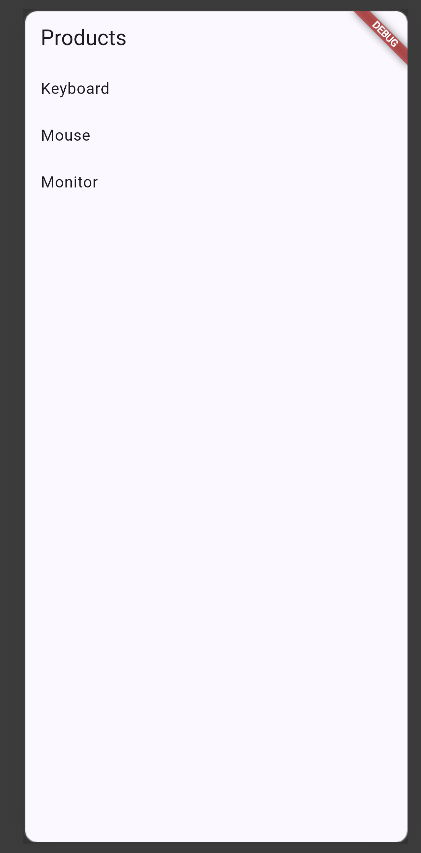
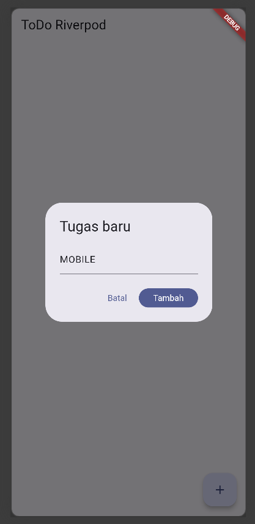
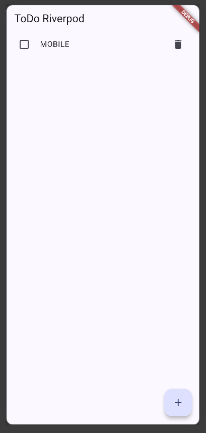
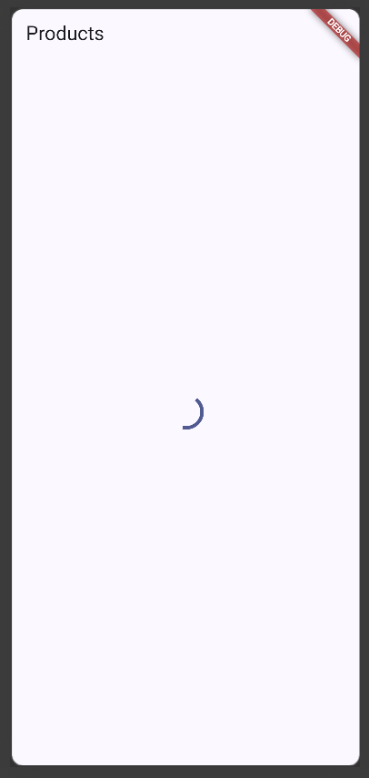
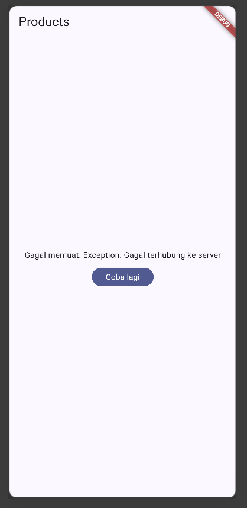
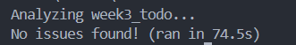
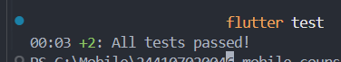
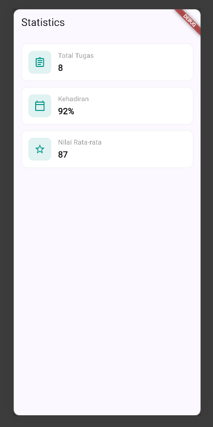
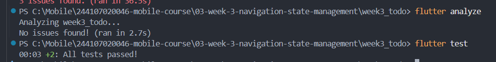

### week3_todo

## Checklist verifikasi mandiri
- [x] Navigasi GoRouter bekerja: pindah halaman, back, dan akses path detail langsung.
- [x] ProviderScope membungkus root aplikasi; state ToDo bertahan saat berpindah halaman.
- [x] UI AsyncValue menangani loading, error, dan success, bukan hanya success.
- [x] `flutter analyze` tanpa issue dan semua test lulus.
- [x] Hasil AI diverifikasi dan didokumentasikan pada folder `docs/`.

## Praktikum 3 — Uji ketiga state

#

#### 1. Salin kode di atas ke project ToDo Anda (atau project terpisah) dan jalankan. Amati tampilan loading selama 2 detik pertama.
! [Screenshot](screenshot/ToDo1.png)

#### 2. Ubah build() sementara untuk melempar error: throw Exception('Gagal terhubung ke server');. Jalankan dan amati UI error beserta tombol Coba lagi.

#### 3. Tekan tombol Coba lagi, ref.invalidate membuat provider dijalankan ulang. Pulihkan kode, pastikan state success tampil.

#### 4. Refleksikan: mengapa menampilkan ulang data lama (stale data) dengan indikator refresh kadang lebih baik daripada mengosongkan layar? Kapan pola itu penting?
- Menampilkan data lama (stale data) dengan indikator refresh lebih baik daripada mengosongkan layar karena pengguna masih dapat melihat informasi yang tersedia selama data baru sedang dimuat. Hal ini membuat aplikasi terasa lebih responsif dan menghindari tampilan kosong atau berkedip.

Pola ini penting ketika data lama masih relevan dan proses pembaruan membutuhkan waktu.

## AI Verification Checklist
1. Apakah state diubah secara immutable (tidak ada state add() atau mutasi list langsung)?
- State tidak dimutasi secara langsung. Perubahan state dilakukan dengan memberikan nilai baru sehingga sesuai dengan prinsip immutability.

2. Apakah ref.watch hanya dipakai di dalam build, dan ref.read di callback?
- ref.watch digunakan di dalam build untuk membuat UI bereaksi terhadap perubahan state. Pada callback, digunakan ref.read agar tidak membuat subscription yang tidak diperlukan.

3. Apakah ketiga state AsyncValue benar-benar ditangani (bukan hanya success)?
- Ketiga kondisi AsyncValue, yaitu loading, error, dan success, sudah ditangani pada UI menggunakan when.

4. Apakah provider dideklarasikan dengan tipe eksplisit dan tidak duplikat dengan provider lain?
- Provider menggunakan tipe eksplisit AsyncNotifierProvider<StatsNotifier, List<String>> dan memiliki nama yang berbeda dari provider ToDo maupun Product.

5. Apakah kode AI memakai API Riverpod versi lama (StateProvider antipattern, StateNotifierProvider usang, atau Consumer bertingkat yang tidak perlu)? Perbaiki ke pola Notifier/ConsumerWidget.
- Kode menggunakan pola AsyncNotifier dan ConsumerWidget. StateNotifierProvider tidak digunakan

6. Jalankan flutter analyze dan flutter test, apakah hasil AI lolos tanpa warning?

|Flutter analyze|Flutter Test|
|---|---|
|  |  |

| Pemeriksaan | Hasil |
|---|---|
| State immutable | Tidak ditemukan mutasi langsung |
| ref.watch | Digunakan di dalam build |
| ef.read | Digunakan pada callback |
| Loading | Ditangani |
| Error | Ditangani dengan tombol retry |
| Success | Ditangani dengan ListView |
| Provider | Menggunakan AsyncNotifierProvider |
| API Riverpod lama | Tidak digunakan |

## Testing

#### Reflection
[Week 03 Reflection](../notes/reflections/Week03.md)