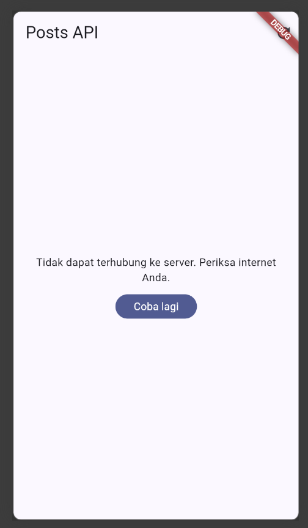
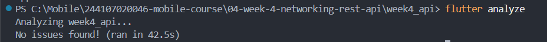
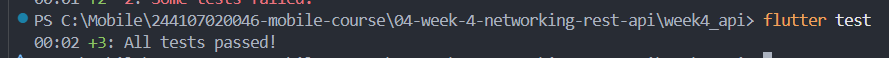
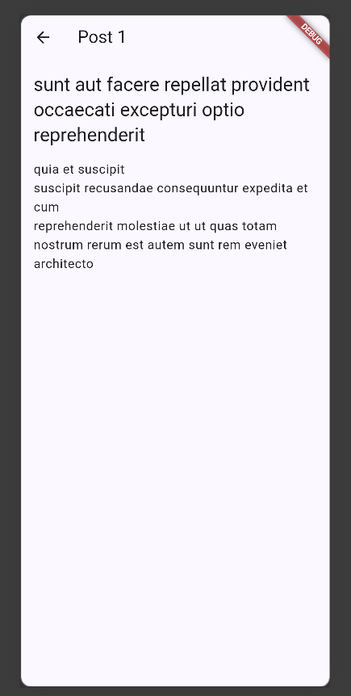
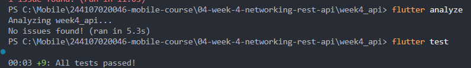

# week4_api

## AI Prompt Challenge
Buatkan repository layer Flutter untuk endpoint GET /comments?postId={id}
dari JSONPlaceholder menggunakan Dio + flutter_riverpod.
Requirements:
- Model Comment dengan fromJson aman null (postId, id, name, email, body).
- CommentRepository dengan method fetchComments(postId) + timeout 10 detik.
- AsyncNotifierProvider dengan penanganan error otomatis (AsyncError)
  dan fungsi pesan error
  ramah pengguna untuk timeout, connection error, 404, dan 500.
- Satu unit test untuk fromJson dengan field yang hilang.
Jelaskan setiap bagian kode dalam komentar.

### Hasil dari AI

AI menghasilkan implementasi repository layer untuk mengambil data
comment dari JSONPlaceholder menggunakan Dio dan flutter_riverpod.

Implementasi terdiri dari:

1. `Comment` sebagai model untuk merepresentasikan data comment.
2. `CommentRepository` untuk menangani request GET ke JSONPlaceholder.
3. `CommentNotifier` dan `AsyncNotifierProvider` untuk mengelola data
   asynchronous dan state loading, data, serta error.
4. `friendlyCommentErrorMessage()` untuk mengubah error teknis menjadi
   pesan yang lebih mudah dipahami pengguna.
5. Unit test untuk menguji `Comment.fromJson()` ketika terdapat field
   JSON yang hilang.

### Struktur Data

Model `Comment` memiliki beberapa field:

- `postId`
- `id`
- `name`
- `email`
- `body`

`Comment.fromJson()` dibuat agar aman terhadap field yang bernilai null
atau tidak tersedia. Nilai default digunakan ketika field tidak ditemukan.

Contoh:

```dart
postId: (json['postId'] as num?)?.toInt() ?? 0,
id: (json['id'] as num?)?.toInt() ?? 0,
name: json['name'] as String? ?? '',
email: json['email'] as String? ?? '',
body: json['body'] as String? ?? '',

```

### AI Verification Checklist

Sebelum kode dari AI diterima, dilakukan verifikasi terhadap setiap
requirement dan dilakukan perbaikan jika diperlukan.

| No. | Pemeriksaan | Sebelum Verifikasi | Temuan | Sesudah Verifikasi |
|---|---|---|---|---|
| 1 | `fromJson` aman terhadap null | AI sudah menggunakan nullable cast dan `??` untuk field `postId`, `id`, `name`, `email`, dan `body`. | Tidak ditemukan masalah pada parsing field yang null atau hilang. | **Lolos.** `Comment.fromJson()` tetap menggunakan nullable parsing dan nilai default. |
| 2 | Endpoint API | AI menggunakan `GET /comments` dengan `postId` sebagai query parameter. | Endpoint sudah sesuai dengan requirement `GET /comments?postId={id}`. | **Lolos.** `fetchComments(postId)` menggunakan `queryParameters: {'postId': postId}`. |
| 3 | Timeout | AI memberikan konfigurasi timeout 10 detik pada Dio. | Timeout sudah sesuai requirement. | **Lolos.** `connectTimeout` dan `receiveTimeout` dikonfigurasi selama 10 detik. |
| 4 | Error handling | AI menggunakan `AsyncNotifier` dan fungsi `friendlyCommentErrorMessage()`. | Penanganan timeout, connection error, 404, dan 500 sudah tersedia. | **Lolos.** Error diproses menjadi pesan yang lebih mudah dipahami pengguna. |
| 5 | Edge case test | AI menyediakan pengujian untuk kondisi field JSON yang hilang. | Test perlu dipastikan benar-benar menguji field yang tidak tersedia, bukan hanya data lengkap. | **Ditambahkan.** Test `Comment.fromJson()` menggunakan JSON yang tidak memiliki `name`, `email`, dan `body`. |








### Edge Case Test

Untuk memastikan `fromJson()` tidak hanya diuji pada kondisi normal
(happy path), ditambahkan pengujian dengan JSON yang tidak lengkap.

```dart
test('Comment.fromJson menangani field yang hilang', () {
  final comment = Comment.fromJson({
    'postId': 1,
    'id': 1,
  });

  expect(comment.postId, 1);
  expect(comment.id, 1);
  expect(comment.name, '');
  expect(comment.email, '');
  expect(comment.body, '');
});

```

### Detail Page


### Flutter analyze + test



## Checklist Verifikasi Mandiri
- [x] UI tidak memanggil Dio langsung, semua akses data lewat repository + provider.
- [x] Empat state tampil benar: loading, error (+ retry), empty, success.
- [x] Pagination: data bertambah saat scroll, tidak ada request ganda, ada indikator akhir data.
- [x] `flutter analyze` tanpa issue dan semua test lulus.
- [x] Hasil AI diverifikasi dan didokumentasikan pada folder `docs/`.

#### Reflection
[Week 04 Reflection](../notes/reflections/Week04.md)
