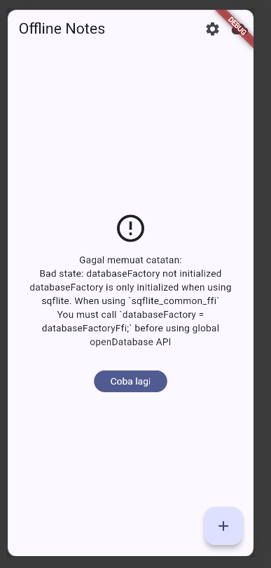

# week5_offline_notes

### AI Prompt Challenge
Aplikasi Flutter Offline Notes: CRUD catatan + preferensi tema.

Bandingkan SharedPreferences, Hive, sqflite (SQLite), dan Drift
untuk dua kebutuhan ini.

Requirements:
- Kriteria: kompleksitas query, kebutuhan relasi, reaktivitas (stream),
  type-safety, ukuran boilerplate, dan kemudahan testing.
- Beri rekomendasi final: mana untuk preferensi, mana untuk catatan,
  beserta alasannya dalam 1 tabel.
- Tunjukkan skema tabel/kotak untuk 1000+ catatan.
Jelaskan trade-off setiap pilihan.

| Kriteria | SharedPreferences | Hive | sqflite (SQLite) | Drift |
|---|---|---|---|---|
| Kompleksitas query | Sangat rendah | Rendah | Tinggi | Sedang |
| Relasi antar data | Tidak cocok | Terbatas | Sangat baik | Sangat baik |
| Reaktivitas / Stream | Tidak utama | Terbatas | Tidak otomatis | Sangat baik |
| Type-safety | Rendah | Sedang | Rendah–sedang | Tinggi |
| Boilerplate | Sangat sedikit | Sedikit | Sedang | Lebih banyak |
| Testing | Mudah | Mudah | Cukup mudah | Mudah setelah setup |
| Cocok untuk preferensi | **Ya** | Bisa | Berlebihan | Berlebihan |
| Cocok untuk 1000+ catatan | **Tidak disarankan** | Bisa | **Ya** | **Ya** |

| Kebutuhan | Pilihan | Alasan |
|---|---|---|
| Preferensi tema | **SharedPreferences** | Data sederhana berupa key-value seperti `dark_mode` |
| Catatan | **SQLite / sqflite** | Mendukung data dalam jumlah besar, query, CRUD, dan dapat menggunakan kolom `dirty` serta `updated_at` untuk kebutuhan offline-first dan sinkronisasi |

┌──────────────────────────────┐
│            notes             │
├──────────────────────────────┤
│ id           INTEGER   PK    │
│ title        TEXT            │
│ body         TEXT            │
│ updated_at   TEXT            │
│ dirty        INTEGER         │
└──────────────────────────────┘

### AI Verification Checklist
1. Apakah AI menempatkan daftar catatan di SharedPreferences? (menolak: rapuh untuk koleksi).
- AI tidak merekomendasikan SharedPreferences untuk menyimpan daftar catatan. SharedPreferences lebih sesuai untuk data preferensi sederhana seperti status dark mode.

2. Apakah skema AI mendukung antrean sync (dirty flag / updated_at) atau hanya CRUD polos?
- Ya. Field dirty digunakan untuk mengetahui apakah catatan memiliki perubahan lokal yang belum disinkronkan.

3. Apakah klaim "real-time" AI didukung stream (Drift/watch) atau hanya asumsi?
- AI menyebut bahwa Drift memiliki dukungan reactive query/stream. Hal tersebut berbeda dengan SQLite melalui sqflite yang digunakan pada project ini. Pada implementasi sqflite, perubahan database tidak otomatis membuat UI mendapatkan stream perubahan seperti pola reactive query. real-time tidak digunakan untuk mengklaim bahwa sqflite secara otomatis memberikan stream.

4. Apakah estimasi boilerplate AI masuk akal setelah Anda mencoba instalasinya (flutter pub add + migrasi skema)?
- Setelah mencoba instalasi package menggunakan flutter pub add, dependency seperti shared_preferences, sqflite, dan path dapat digunakan pada project. Untuk SharedPreferences, boilerplate relatif sedikit karena hanya membutuhkan repository untuk menyimpan dan membaca preferensi. Sementara itu, sqflite membutuhkan kode tambahan untuk database, pembuatan tabel, model, dan repository sehingga boilerplate lebih banyak. Hal tersebut sesuai dengan kebutuhan penyimpanan catatan yang memiliki struktur dan operasi CRUD.

5. Keputusan final Anda beserta alasannya, boleh berbeda dari rekomendasi AI selama berargumen.
- Keputusan final: menggunakan SharedPreferences untuk preferensi aplikasi dan SQLite (sqflite) untuk data catatan.
- Alasan: SharedPreferences cocok untuk menyimpan data sederhana seperti pengaturan dark mode dan waktu terakhir aplikasi dibuka. Untuk catatan, SQLite lebih sesuai karena dapat menyimpan banyak data secara terstruktur serta mendukung operasi CRUD dan query. SQLite juga dapat menggunakan field dirty dan updated_at yang dibutuhkan untuk fitur offline-first dan sinkronisasi.