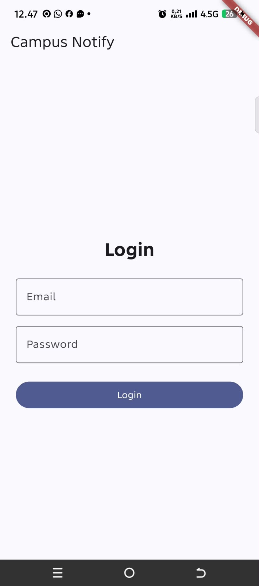
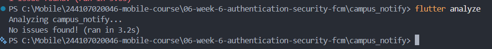
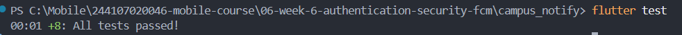

# campus_notify

### fcm console

| State | Yang diharapkan | Cara uji | Hasil aktual |
|---|---|---|---|
| Foreground | Notifikasi lokal muncul dan klik membuka `/pengumuman/3` | Aplikasi terbuka, kirim pesan, lalu klik notifikasi | Berhasil |
| Background | Notifikasi sistem muncul dan klik membuka `/pengumuman/3` | Tekan Home, kirim pesan, lalu klik notifikasi | Berhasil |
| Terminated | Aplikasi dibuka kembali dan menuju rute yang benar melalui `getInitialMessage()` | Tutup aplikasi dari recent apps, kirim pesan, lalu klik notifikasi | Berhasil |

### AI Prompt 
1. Android 13+ Notification Permission & Desugaring: Added <uses-permission android:name="android.permission.POST_NOTIFICATIONS"/> in AndroidManifest.xml and enabled isCoreLibraryDesugaringEnabled = true in build.gradle.kts.
2. GoRouter Guard Deep-Link Bypass: Updated redirect logic in lib/main.dart to allow public announcement routes (/announcement/:id) without being blocked by /login.
3. Local Notification Tap Syntax & Callback: Fixed InitializationSettings parameter name syntax (settings:) and bound _onRouteTap callback to navigate immediately on tap.

### Reflection
1. Mengapa refresh token tidak boleh disimpan di SharedPreferences? Apa risikonya bila bocor?
- Refresh token tidak disarankan disimpan di SharedPreferences karena penyimpanan tersebut tidak dirancang khusus untuk melindungi data sensitif. Jika perangkat berhasil diakses oleh pihak yang tidak berwenang atau aplikasi memiliki celah keamanan, token berisiko terbaca.
Jika refresh token bocor, orang lain dapat menggunakannya untuk meminta access token baru dan mengakses akun pengguna tanpa harus mengetahui password, selama token masih berlaku dan belum dicabut. Oleh karena itu, refresh token sebaiknya disimpan menggunakan penyimpanan yang lebih aman, seperti flutter_secure_storage.

2. Apa yang rusak bila onTokenRefresh diabaikan selama satu semester perkuliahan?
- aplikasi mungkin masih menggunakan FCM token lama ketika Firebase mengganti token perangkat. Akibatnya, server dapat menyimpan token yang sudah tidak berlaku sehingga notifikasi berisiko gagal dikirim ke perangkat pengguna.
Selama satu semester, kondisi ini dapat menyebabkan mahasiswa tidak menerima informasi penting, seperti perubahan jadwal kuliah, pengumuman ujian, atau informasi tugas. Karena itu, aplikasi perlu mendengarkan perubahan token melalui onTokenRefresh dan mengirimkan token terbaru ke server agar data perangkat tetap diperbarui.

3. Kapan memakai topik dan kapan memakai token perangkat? Beri contoh pesan kampus untuk masing-masing.
- Topik (topic) digunakan ketika pesan ditujukan kepada banyak pengguna yang memiliki kesamaan tertentu. Dengan topik, aplikasi dapat mengirimkan satu pesan kepada banyak perangkat yang telah berlangganan topik tersebut.
Contoh: mahasiswa berlangganan topik pengumuman-kampus. Ketika kampus mengirimkan informasi libur perkuliahan, semua perangkat yang berlangganan topik tersebut dapat menerima notifikasi.
- Token perangkat (device token) digunakan ketika pesan ditujukan kepada perangkat tertentu. Setiap perangkat memiliki FCM token yang digunakan untuk menentukan tujuan pengiriman notifikasi.
Contoh: aplikasi mengirimkan notifikasi pengingat kepada seorang mahasiswa bahwa pembayaran UKT miliknya belum diselesaikan.

4. Bagian mana dari draf AI yang Anda tolak atau perbaiki, dan mengapa?
- Android 13+ Permission & Desugaring: Initial AI boilerplate omitted POST_NOTIFICATIONS in AndroidManifest.xml and isCoreLibraryDesugaringEnabled in Gradle. Without these, builds fail or notifications are blocked silently on Android 13+.
- GoRouter Guard Blocking Deep Links: Initial AI draft route guards redirected unauthenticated deep link navigation to /login. Fixed the guard redirect logic to allow public announcement routes (/announcement/:id).
- Foreground Banner Callbacks: Fixed InitializationSettings parameter syntax for flutter_local_notifications and bound tap callbacks (_onRouteTap) so local notification clicks trigger router.go(route).